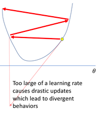

# &Iacute;ndice

1.  [¿En qué tipo de problemas es adecuado utilizar aprendizaje automático?](#p1)
2.  [¿Cuál es la diferencia entre la función de costo o pérdida, y las métricas de rendimiento del modelo?](#p2)
3.  [¿Cómo se puede entrenar un modelo utilizando features o características no numéricas?](#p3)
4.  [Explique por qué se intenta minimizar la función de costo utilizando un método iterativo (numérico) y no un método analítico minimizando la derivada de la función](#p4)
5.  [¿Por qué el algoritmo SGD se llama “estocástico”?](#p5)
6.  [¿Qué impacto tiene el learning rate en la optimización de la función?](#p6)
7.  [Si una red tiene muy buen rendimiento durante el entrenamiento, pero muy bajo rendimiento en un conjunto de datos de evaluación, ¿qué acciones tomaría para mejorar el modelo?](#p7)

# ¿En qué tipo de problemas es adecuado utilizar aprendizaje automático?

Es conveniente usarlo cuando tenemos un problema que consiste en detectar patrones que son muy complejos como para programar. Por ejemplo, detectar peatones en una imagen es una tarea muy compleja de escribir en código, sin embargo, se puede entrenar un modelo con muchas imágenes ya clasificadas.
También los problemas en los que queremos no determinismo, como por ejemplo la generación de texto, son muy aptos para ser implementados en un modelo de aprendizaje automático.
Por lo general, tenemos una gran base de datos sobre la que entrenar nuestro modelo.

# ¿Cuál es la diferencia entre la función de costo o pérdida, y las métricas de rendimiento del modelo?

La métrica de rendimiento nos dice qué tan acertadas son nuestras predicciones, y es para que nosotros lo interpretemos. La función de pérdida toma una predicción y devuelve un valor que representa qué tan mala es esa predicción. Para entrenar nuestro modelo vamos a minimizar la función de costo, por lo que ahí está la diferencia: la función de costo debe ser una función fácil de derivar. Sin embargo, puede ocurrir que la métrica de rendimiento y la función de costo sean parecidas.

# ¿Cómo se puede entrenar un modelo utilizando features o características no numéricas?

Como a nuestro modelo le tenemos que pasar números, tenemos que encontrar una forma de convertir las categorías en números.

## codificación ordinal

Se usa cuando nuestras categorías tienen algún orden asociado, como por ejemplo *'pequeño'*, *'medio'*, *'grande'*. En este caso le podríamos asignar a cada categoría un número diferente, empezando desde la 'primera' hasta la 'última'.

## one-hot encoding

Esto consiste en crear una columna por cada una de los diferentes valores que puede tomar la feature.

Por ejemplo, supongamos que en el conjunto de datos tenemos una feature *'idioma'*, que puede tomar los valores *'castellano'*, *'inglés'* o *'klingon'*. Luego de hacer el one-hot encoding me quedaría:

<table border="2" cellspacing="0" cellpadding="6" rules="groups" frame="hsides">

<colgroup>
<col  class="org-right" />

<col  class="org-right" />

<col  class="org-right" />
</colgroup>
<thead>
<tr>
<th scope="col" class="org-right">castellano</th>
<th scope="col" class="org-right">inglés</th>
<th scope="col" class="org-right">klingon</th>
</tr>
</thead>

<tbody>
<tr>
<td class="org-right">0</td>
<td class="org-right">1</td>
<td class="org-right">0</td>
</tr>

<tr>
<td class="org-right">1</td>
<td class="org-right">0</td>
<td class="org-right">0</td>
</tr>

<tr>
<td class="org-right">0</td>
<td class="org-right">0</td>
<td class="org-right">1</td>
</tr>
</tbody>
</table>

Este tipo de codificación es útil porque si decidiésemos codificar cada categoría con un número arbitrario, tendríamos el problema de que los números tienen relación entre ellos que no necesariamente está en las categorías. Por ejemplo, si codificásemos *'inglés'* a 1 y *'klingon'* a 2, el modelo podría interpretar que '*klingon* es el doble que *inglés*'.

# Explique por qué se intenta minimizar la función de costo utilizando un método iterativo (numérico) y no un método analítico minimizando la derivada de la función

En algunos modelos, como las redes neuronales, los métodos analíticos son demasiado complejos de calcular, por lo que son preferibles los métodos iterativos.

# ¿Por qué el algoritmo SGD se llama “estocástico”?

Es estocástico porque es no determinista, ya que empezamos con unos parámetros aleatorios, lo que puede hacer que en diferentes corridas lleguemos a mínimos diferentes. Además, si agregamos batching, también está la cuestión de que los batches se forman con un subconjunto aleatorio del dataset, lo que introduce aún más no-determinismo.

# ¿Qué impacto tiene el learning rate en la optimización de la función?

Un learning rate muy chico puede hacer que converja muy lento el algoritmo. Por otro lado, un learning rate muy alto puede hacer que diverja, como está graficado en la siguiente imagen:

# Si una red tiene muy buen rendimiento durante el entrenamiento, pero muy bajo rendimiento en un conjunto de datos de evaluación, ¿qué acciones tomaría para mejorar el modelo?

Esto puede ser debido a overfitting. Se puede solucionar eliminando features redundantes y/o haciendo regularización de los datos.

